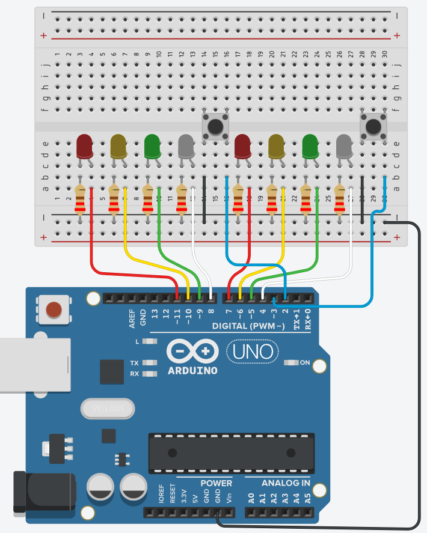

# AVR Traffic Light System with Crossing Lane & Crosswalk

## Objective

This project implements a realistic, interrupt-driven traffic light controller for a two-way intersection using AVR assembly language on an ATmega328P microcontroller. It manages traffic flow for two perpendicular lanes and includes pedestrian crosswalk functionality with visual feedback.

## Diagram

## Features

* **Two-Lane Traffic Control:** Manages Red, Yellow, and Green LEDs for both a Main lane and a Crossing lane.
* **Safe Sequencing:** Ensures safe traffic flow by alternating green lights and incorporating all-red phases between conflicting green lights.
* **Pedestrian Crosswalks:** Includes independent push-buttons for pedestrians on both lanes (using INT0 and INT1).
* **Interrupt-Driven:** Utilizes Timer1 (CTC mode) for precise state timing and External Interrupts (INT0, INT1) for immediate button press detection. No blocking `delay` loops are used for core timing.
* **Blinking Walk Signal:** The pedestrian "Walk" LED turns on solid for the first half of the walk cycle and blinks for the second half as a warning.
* **Software Debouncing:** Implements a timer-based debounce mechanism to handle noisy button presses reliably.
* **State Machine Logic:** Uses a well-defined state machine managed within the Timer1 ISR to control the traffic light sequences.

## Hardware

* **Microcontroller:** ATmega328P (or compatible AVR)
* **Clock Speed:** 16 MHz external crystal/resonator assumed.
* **LEDs:**
    * 2x Red
    * 2x Yellow
    * 2x Green
    * 2x White (or other color for "Walk" signals)
* **Resistors:** 8x Current-limiting resistors for LEDs (e.g., 220Ω - 470Ω, depending on LEDs and voltage).
* **Buttons:** 2x Momentary push-buttons.
* **Power Supply:** 5V DC.

## Software

* **Language:** AVR Assembly Language
* **Core Concepts:**
    * State Machine Design
    * Timer1 CTC Interrupts (for timing state durations)
    * External Interrupts INT0 & INT1 (for button presses)
    * Software Debouncing Logic
    * Direct Port Manipulation (PORTB, PORTD, DDRB, DDRD)
    * Register Usage (`.def` for aliases)

## Pinout / Wiring Summary

(Refer to the `.equ` definitions in the source code for exact pin assignments)

* **Main Lane LEDs (PORTB):**
    * `PB3`: Red 1
    * `PB2`: Yellow 1
    * `PB1`: Green 1
    * `PB0`: Walk 1
* **Crossing Lane LEDs (PORTD):**
    * `PD7`: Red 2
    * `PD6`: Yellow 2
    * `PD5`: Green 2
    * `PD4`: Walk 2
* **Buttons (PORTD):**
    * `PD2` (INT0): Button 1 (Main Lane Crosswalk) -> Connect to GND when pressed (Internal Pull-up Enabled)
    * `PD3` (INT1): Button 2 (Crossing Lane Crosswalk) -> Connect to GND when pressed (Internal Pull-up Enabled)
* **Power:** Connect VCC, AVCC to +5V and GND pins to Ground. Use decoupling capacitors.
* **ISP:** Connect programmer to VCC, GND, RESET, SCK (PB5), MISO (PB4), MOSI (PB3) for flashing. *Note: PB3/MOSI conflicts with Red1 LED - disconnect programmer or LED during respective operations.*

## How it Works

1.  **Initialization:** Sets up the stack, configures I/O pins (LEDs as outputs, buttons as inputs with pull-ups), initializes Timer1 for CTC interrupts every ~0.25s, configures INT0/INT1 for falling-edge triggers, enables interrupts globally (`sei`), and starts in the `STATE_MAIN_GREEN`.
2.  **State Machine:** The `state_reg` holds the current state.
3.  **Timer Interrupt (`TIMER1_COMPA_ISR`):**
    * Runs every ~0.25s.
    * Handles the release/timeout for button debouncing, re-enabling the corresponding external interrupt.
    * If in a blinking walk state, toggles a blink flag and updates the LEDs.
    * Decrements the `tick_counter`.
    * If `tick_counter` reaches zero, calls `update_state`.
4.  **Button Interrupt (`EXT_INT0_ISR`, `EXT_INT1_ISR`):**
    * Runs immediately on a button press (falling edge).
    * Checks if already debouncing; if so, ignores the press.
    * Disables its own interrupt (`EIMSK`) to prevent bounces during debounce.
    * Sets the corresponding `FLAG_DEBOUNCEx_BUSY` and `FLAG_CROSSWALK_REQx` bits in the `flags` register.
5.  **State Transition (`update_state`):**
    * Called by the Timer ISR when a state's time expires.
    * Determines the next state based on the current state and any pending crosswalk requests (`FLAG_CROSSWALK_REQx`).
    * Implements the standard traffic flow (G->Y->AllRed->OtherG->...) and diverts to crosswalk sequences when appropriate.
    * Clears the crosswalk request flag when starting a walk sequence.
    * Loads the duration (in ticks) for the *new* state into `tick_counter`.
6.  **LED Update (`update_lights`):**
    * Called after a state change or during blinking.
    * Reads the current `state_reg` and `flags` register.
    * Calculates the correct bit patterns for PORTB and PORTD based on the state.
    * For blinking states, checks the `FLAG_BLINK_STATE` to determine walk LED status.
    * **Crucially, preserves the pull-up enable bits (PD2, PD3) when writing the LED pattern to PORTD.**
    * Writes the patterns to the physical PORTB and PORTD registers.
